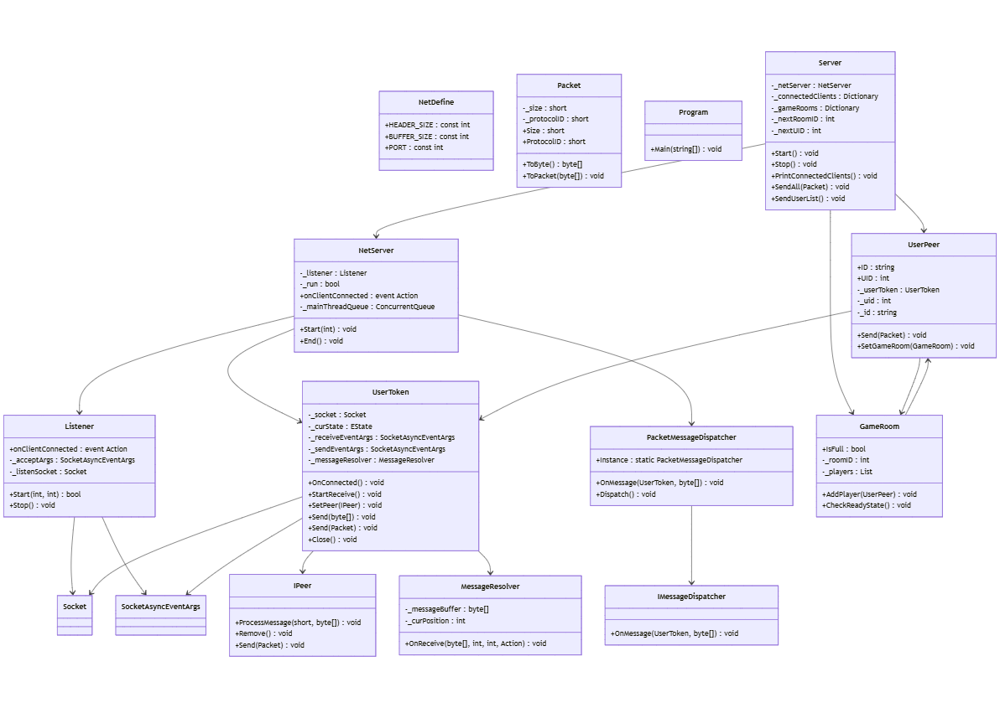

# **서버 중심 클래시 오브 클랜 유형 게임**

## **프로젝트 소개**
이 프로젝트는 **클래시 오브 클랜**과 비슷한 유형의 게임으로, 서버와 클라이언트의 역할을 명확히 분리하고 **로비 서버**와 **게임 서버**를 독립적으로 설계하였습니다.  
이를 통해 **효율적인 관리**와 **확장성**을 목표로 합니다.

---

## **기능 및 구현 내용**

### **1. 서버 구조 설계**
- **로비 서버**  
  - 유저 로그인, 매칭, 게임 시작 준비를 관리.  
- **게임 서버**  
  - 유닛 생성, 리소스 처리, 전투 로직 등 게임의 주요 상태 관리.  
  - 실시간 데이터 동기화를 통해 서버와 클라이언트 상태 일관성 유지.  

---

### **2. 주요 서버 기능**
1. **로비 분리 및 게임 시작**  
   - 서버에서 유저를 로비에 배치하고 게임 매칭 및 시작 관리.  
2. **게임 상태 관리**  
   - 유닛 배치, 리소스 관리, 전투 로직 및 게임 상태 동기화.  
3. **데이터 동기화**  
   - 클라이언트 간 상태를 일관되게 유지하도록 서버를 중심으로 데이터 처리.  

---

## **기술 스택**
- **언어**: C#  
- **네트워크 프로그래밍**: TCP/IP  
- **서버 구조**: 멀티 서버 구조 (로비 서버 + 게임 서버)  
- **기타 기술**: 실시간 동기화, 데이터베이스 설계(진행 중)  

---

## **Class Diagram**

---

## **실행 화면**
### **1. 로비 서버 실행**

### **2. 게임 서버 실행**

---
